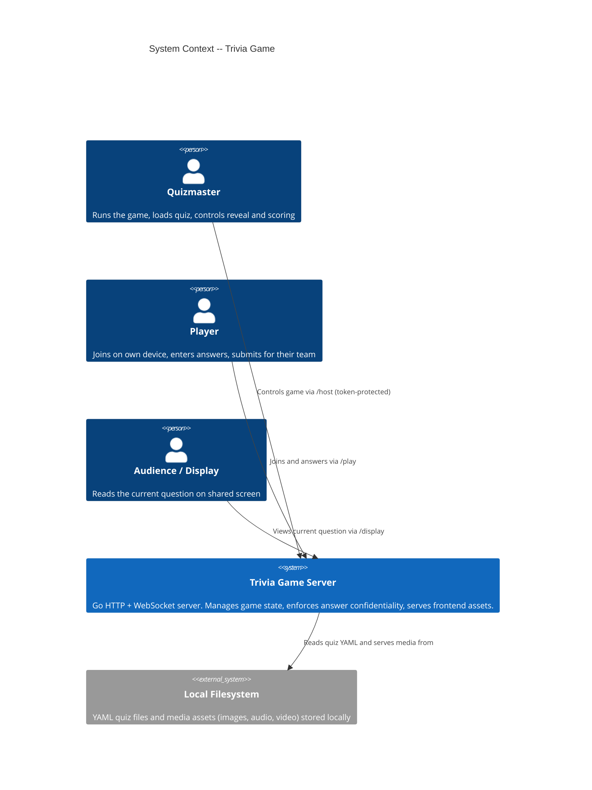
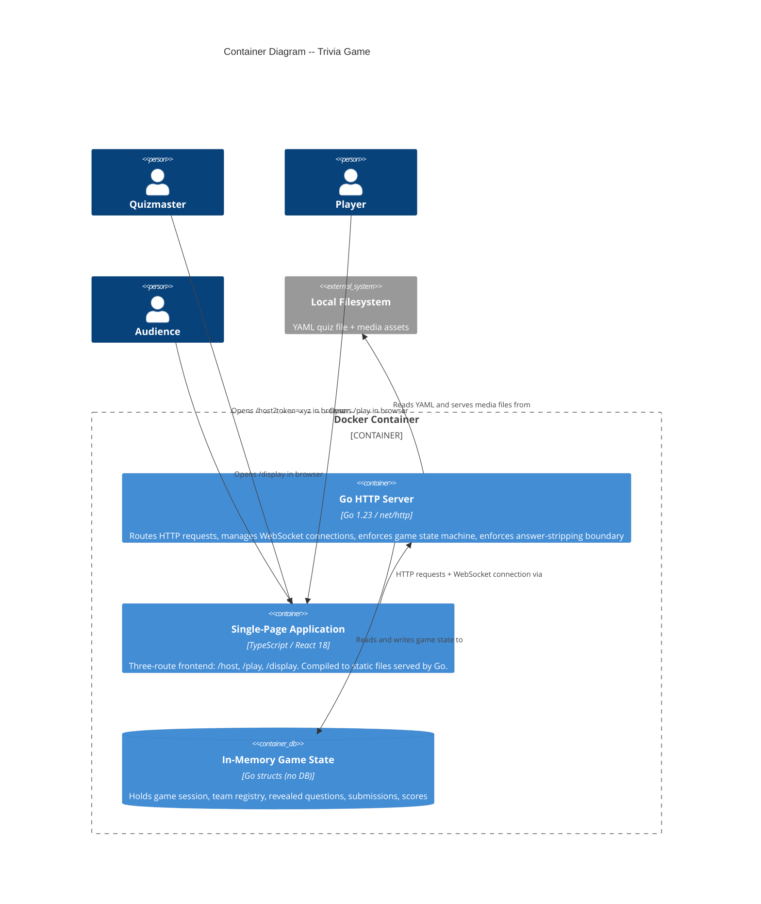
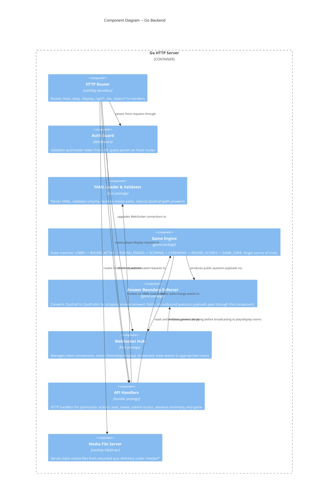

# Architecture Design -- Trivia Game

## Metadata

- Feature ID: trivia
- Phase: DESIGN
- Date: 2026-03-29
- Architect: Morgan (solution-architect)
- Based on: DISCUSS wave handoff (DEC-001 through DEC-014, US-01 through US-19)

---

## 1. System Context

### What the system does

A single-server trivia game application that:
- Loads a YAML quiz file and initializes a game session
- Exposes three URL-based interfaces: `/host`, `/play`, `/display`
- Synchronizes game state in real time across all connected clients via WebSocket
- Enforces answer-field confidentiality (DEC-010): correct answers never leave the server to `/play` or `/display` until ceremony
- Runs locally via Docker for a small group (2-10 devices) on a local network

### C4 Level 1 -- System Context



---

## 2. Container Architecture

### Deployment topology

A single Docker container runs:
- The Go HTTP server (port 8080)
- Serves the compiled TypeScript/React SPA from `/static`
- Mounts the local quiz directory for YAML + media access

Docker Compose manages the single service with a bind-mount volume.

### C4 Level 2 -- Container Diagram



---

## 3. Component Architecture -- Go Backend

The Go backend warrants a Component diagram because it contains 6+ distinct internal responsibilities that must have enforced boundaries.

### C4 Level 3 -- Go Backend Components



---

## 4. Answer-Stripping Boundary Design (DEC-010)

DEC-010 is a security invariant. A structural type boundary -- not a runtime check -- is the only reliable enforcement mechanism.

### Dual-type model

The server maintains two Go struct types for question data:

**QuestionFull** (server-internal only):
- Contains all fields including `Answer` and `Answers`
- Only exists within the `game` package
- Never serialized to JSON for client transport

**QuestionPublic** (safe for /play and /display):
- Structurally identical to QuestionFull minus `Answer` and `Answers`
- All WebSocket payloads and HTTP responses to /play and /display use this type
- The `answerboundary` component is the only point of conversion from Full to Public

**Ceremony exception**: During the CEREMONY game state, the Answer field for the specific question being revealed is included in a `CeremonyRevealEvent` sent only to the `/display` room (not `/play`).

### Enforcement rule

The `handler` package and `hub` package must NEVER import `QuestionFull`. This dependency boundary must be enforced by `go-arch-lint` or `depguard` in CI.

### Required unit test

A unit test in `game/boundary_test.go` must use Go reflection to assert that `QuestionPublic` contains no field named `Answer` or `Answers`. This test is the final safety net that catches accidental field additions to `QuestionPublic`. It must be present before the crafter merges any change to the `game` package types.

---

## 5. WebSocket Event Protocol

All WebSocket messages are JSON with an `event` discriminator field and a `payload` object.

### Event taxonomy

#### Server -> Client events

| Event | Sent to | Trigger | Payload summary |
|-------|---------|---------|-----------------|
| `state_snapshot` | All rooms | Client connects or reconnects | Full current game state (public) |
| `team_joined` | host room | New team registers | `{team_id, team_name, team_count}` |
| `round_started` | play, display | Quizmaster starts round | `{round_index, round_name}` |
| `question_revealed` | play, display | Quizmaster reveals question | `{round_index, question_index, question: QuestionPublic}` |
| `submission_received` | host room | Team submits answers | `{team_id, team_name}` |
| `scoring_opened` | host room | All teams submitted OR quizmaster forces | `{submissions: [{team_id, answers[]}]}` |
| `ceremony_question_shown` | display | Quizmaster shows ceremony question | `{question_index, question: QuestionPublic}` |
| `ceremony_answer_revealed` | display | Quizmaster reveals ceremony answer | `{question_index, answer: string}` |
| `round_scores_published` | all rooms | Quizmaster publishes round scores | `{round_index, scores: [{team_id, team_name, round_score, running_total}]}` |
| `game_over` | all rooms | Quizmaster ends game | `{final_scores: [{team_id, team_name, total}]}` |
| `error` | sender only | Any validation failure | `{code, message}` |

#### Client -> Server events

| Event | Sent by | Payload summary |
|-------|---------|-----------------|
| `team_register` | play | `{team_name, device_token}` |
| `team_rejoin` | play | `{team_id, device_token}` |
| `draft_answer` | play | `{team_id, round_index, question_index, answer}` |
| `submit_answers` | play | `{team_id, round_index, answers: [{question_index, answer}]}` |
| `host_load_quiz` | host | `{file_path}` |
| `host_start_round` | host | `{round_index}` |
| `host_reveal_question` | host | `{round_index, question_index}` |
| `host_mark_answer` | host | `{team_id, round_index, question_index, verdict: "correct"\|"wrong"}` |
| `host_ceremony_show_question` | host | `{question_index}` |
| `host_ceremony_reveal_answer` | host | `{question_index}` |
| `host_publish_scores` | host | `{round_index}` |
| `host_end_game` | host | `{}` |

### Reconnection behavior

- Server sends `state_snapshot` on every new WebSocket connection/reconnection
- Client-side: exponential backoff starting at 1s, max 30s, max 10 attempts
- `/play` clients store `team_id` + `device_token` in localStorage; on reconnect, send `team_rejoin` event
- Team uniqueness enforced at registration: duplicate team name rejected with `error` event

### Submission acknowledgment (DEC-012)

`submit_answers` triggers a server-side write to in-memory submissions map, then server sends `submission_ack` event back to the submitting client. Client shows "Your answers are locked in" only after receiving `submission_ack`. Client retries on WebSocket failure (idempotent: server detects duplicate submission by team+round key and re-sends ack without overwriting).

---

## 6. Game State Machine

```
LOBBY
  -> [host_start_round] -> ROUND_ACTIVE

ROUND_ACTIVE
  -> [host_reveal_question] -> ROUND_ACTIVE (stays, adds to revealed set)
  -> [host_end_round after all questions revealed] -> ROUND_ENDED

ROUND_ENDED
  -> [all teams submitted OR host forces scoring] -> SCORING

SCORING
  -> [host completes marking all answers] -> CEREMONY

CEREMONY
  -> [host completes all ceremony questions] -> ROUND_SCORES

ROUND_SCORES
  -> [host starts next round] -> ROUND_ACTIVE
  -> [host ends game] -> GAME_OVER

GAME_OVER  (terminal state)
```

State transitions are validated by the Game Engine. Invalid transitions return an error event to the requesting client.

---

## 7. Docker Deployment Design

### Single container, Docker Compose orchestration

A single Docker container is sufficient for a personal-use tool on a local network. Docker Compose provides the volume mount and environment variable wiring.

```
trivia-app (single container)
  - Go binary (backend)
  - Static SPA assets (embedded in binary via go:embed)
  - Bind-mount: quiz files from host filesystem
  - Port 8080 exposed
```

### Build strategy: multi-stage Dockerfile

**Stage 1: frontend build**
- Node 20 Alpine image
- Installs TypeScript/React dependencies, compiles SPA to `dist/`

**Stage 2: backend build**
- Go 1.23 Alpine image
- Copies `dist/` from Stage 1 into `internal/static/`
- Compiles Go binary with `go:embed` baking in the static files

**Stage 3: runtime**
- `scratch` or `gcr.io/distroless/static` (minimal attack surface)
- Copies compiled binary only
- Exposes port 8080

### docker-compose.yml structure

```yaml
services:
  trivia:
    build: .
    ports:
      - "8080:8080"
    volumes:
      - ./quizzes:/quizzes:ro
    environment:
      - HOST_TOKEN=${HOST_TOKEN}
      - QUIZ_DIR=/quizzes
```

The `HOST_TOKEN` value is set in a `.env` file (git-ignored) or passed on the command line.

---

## 8. Quizmaster Token Auth Design (OQ-03)

### Mechanism: URL query token + in-memory validation

- At server startup, `HOST_TOKEN` is read from environment variable
- Any request to `/host*` must include `?token=<value>` matching `HOST_TOKEN`
- The Auth Guard middleware validates this on every HTTP request and WebSocket upgrade for the host room
- Token is never included in responses or broadcast events
- No session cookie or JWT needed (personal use, local network)

### Token security properties

- Token is set once at startup, does not change during a game session
- Quizmaster bookmarks `/host?token=xyz` for convenience
- Any player who guesses the `/host` URL without the correct token receives HTTP 403
- The token is never transmitted in WebSocket message payloads

### Open question resolved (OQ-03)

URL token is chosen over simple password (no login form complexity) and over no-auth (prevents accidental or malicious access on shared network). Adequate for personal-use local network threat model.

---

## 9. Quality Attribute Strategies

### Maintainability
- Ports-and-adapters (dependency inversion) separates domain logic from transport
- Game Engine (`game` package) has no imports from `handler` or `hub` packages
- Enforcement: `go-arch-lint` (see ADR-005)

### Testability
- Game Engine is a pure state machine; unit-testable without HTTP or WebSocket
- Answer Boundary Enforcer is independently testable: given QuestionFull, assert QuestionPublic contains no answer fields
- YAML Loader is independently testable against fixture files

### Performance
- In-memory state: no database I/O on hot path
- WebSocket broadcast is fan-out from a single goroutine hub; adequate for 2-10 devices
- Static assets embedded in binary: no file system I/O for JS/CSS

### Reliability
- Reconnection protocol (exponential backoff) handles dropped connections
- Submission idempotency prevents double-submission on retry
- State snapshot on connect means late joiners and reconnectors get full current state

### Security
- DEC-010 enforced structurally via dual-type model (cannot accidentally leak)
- Token auth on /host prevents unauthorized game control
- Media files served from a read-only bind mount (`:ro` in compose)
- Distroless runtime image reduces attack surface

---

## 10. YAML Schema Design

The YAML schema for Release 1 (text questions only):

```yaml
title: string (required)
rounds:
  - name: string (required)
    questions:
      - text: string (required)
        answer: string (required for single-answer)
        # answers: [string] -- Release 3+ (multi-part)
        # choices: [string] -- Release 3+ (multiple choice)
        # media: {type: image|audio|video, file: relative/path} -- Release 3+
```

Validation rules enforced at load time:
- `title` present and non-empty
- `rounds` array present and non-empty
- Each round has `name` and non-empty `questions` array
- Each question has `text` and at least one of `answer` or `answers`
- Release 1: `answers`, `choices`, `media` fields are parsed but generate a warning (not an error), deferred to Release 3

---

## 11. YAML File Access Design (OQ-06)

- Quiz YAML and media files reside in a host-filesystem directory mounted read-only into the container at `/quizzes`
- The quizmaster provides a file path relative to `/quizzes` in the load UI
- Go's `net/http.FileServer` serves `/media/*` requests mapped to the mounted `/quizzes` directory
- Symlink traversal is disabled (Go's FileServer default behavior)

---

## 12. External Integrations

This system has **no external API integrations**. All functionality is self-contained. The filesystem is a local dependency, not a network service.

No contract tests are required.

---

## 13. Architectural Enforcement Tooling

| Rule | Tool | Configuration |
|------|------|---------------|
| `handler` and `hub` packages must not import `QuestionFull` | `go-arch-lint` (MIT) | Dependency rule in `.go-arch-lint.yml` |
| `game` package must not import `handler` or `hub` | `go-arch-lint` | Dependency rule in `.go-arch-lint.yml` |
| Frontend: `/host` routes must not be accessible without token | Enforced server-side; no client enforcement needed | N/A |
| TypeScript strict mode | `tsconfig.json` `"strict": true` | `tsconfig.json` |
| No `any` type in frontend WebSocket message handlers | ESLint `@typescript-eslint/no-explicit-any` | `.eslintrc` |

`go-arch-lint` (MIT license, https://github.com/fe3dback/go-arch-lint) is the recommended enforcement tool for Go dependency rules.

---

## Handoff Notes for Platform Architect

- Development paradigm: OOP with ports-and-adapters (Go interfaces as ports, structs as adapters)
- No external API integrations; no contract tests required
- Go binary embeds frontend static assets via `go:embed` -- frontend must be built before Go build
- `HOST_TOKEN` environment variable must be set at container startup; server fails fast if absent
- All CI pipeline jobs should run `go-arch-lint` to enforce package dependency rules
