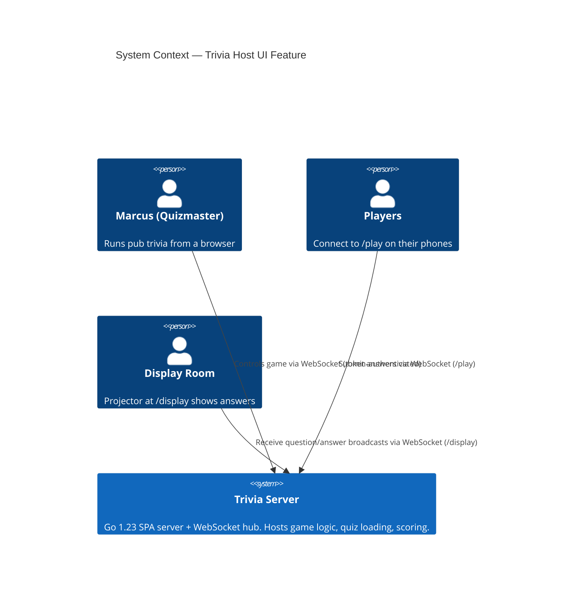
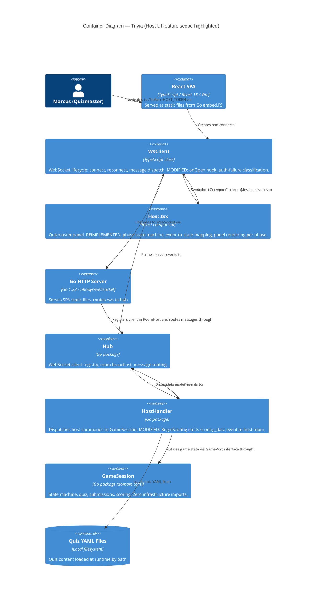
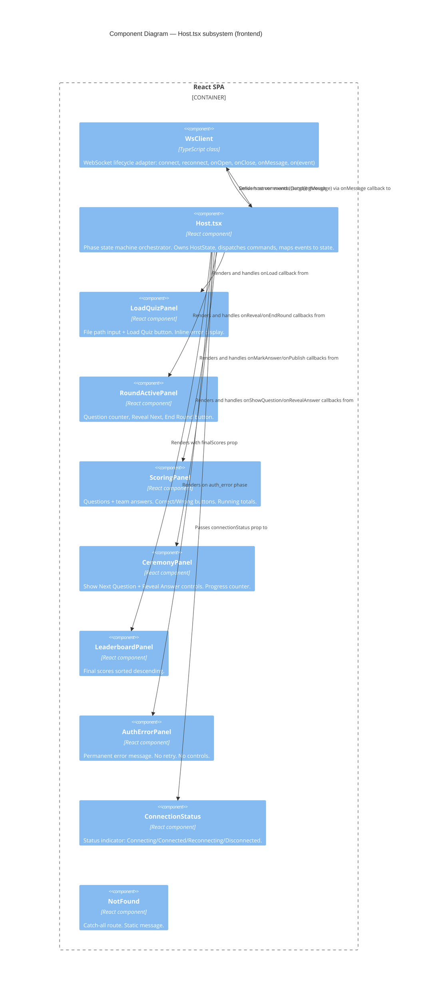

# Architecture Design — Host UI (Quizmaster Panel)

**Feature ID**: host-ui
**Date**: 2026-04-09
**Wave**: DESIGN
**Architect**: Morgan (Solution Architect)
**Status**: Approved

---

## 1. System Context

The trivia system consists of a single Go server serving a React SPA over HTTP/WebSocket. The host
(Marcus, quizmaster) connects via WebSocket using a shared secret token. The system's context in
relation to the host feature is unchanged: there are no new external systems introduced.



---

## 2. Container Architecture

The existing container topology is retained. This feature modifies two existing containers:
`WsClient` (frontend infrastructure) and `Host.tsx` (frontend UI). One new server-side event type
is added to the `hub` package to resolve IC-4.



---

## 3. Integration Point Resolutions

### IC-1: WsClient `onOpen` Hook (BLOCKS ALL)

**Problem**: `connect()` is synchronous; `setConnected(true)` in `Host.tsx` executes before the
WebSocket handshake completes. `WsClient` exposes no success-path lifecycle hook.

**Resolution**: Add `onOpen(handler: () => void): void` to `WsClient`. Inside the internal
`ws.onopen` callback, after resetting backoff counters, iterate and invoke all registered open
handlers. `Host.tsx` registers its `setConnected(true)` call exclusively inside this hook.
`setConnected(true)` is removed from the synchronous code path immediately following `connect()`.

**Contract**: `onOpen` fires exactly once per successful handshake. On reconnect (after a prior
drop), it fires again — this is correct: the connection is genuinely re-established.

**Boundary compliance**: `WsClient` is a frontend infrastructure adapter (driven adapter in
ports-and-adapters terms). The hook is an observable lifecycle event. `Host.tsx` (the application
layer) depends on this adapter via the `onOpen` callback registration — dependency direction is
correct (Host depends on WsClient, not the reverse).

---

### IC-2: CloseEvent.code Inspection for Auth Failure Classification

**Problem**: `WsClient.onclose` ignores `CloseEvent.code`. HTTP 403 on WebSocket upgrade
materialises as a close with code `1006` (abnormal closure). The client cannot distinguish this
from a transient network drop and enters a retry loop.

**Resolution**: Modify `ws.onclose` to accept `CloseEvent`. Inspect `event.code` at close time.
When `event.code === 1006` AND `this.attempt === 0` AND no `onOpen` has previously fired (tracked
via a boolean `private handshakeSucceeded = false` set in `ws.onopen`), emit a new named client
event `connection_refused` and set `this.closed = true` (stopping all retry). For all other close
codes, or after a prior successful handshake, continue the existing reconnect strategy.

**Classification table**:

| Condition | Interpretation | Action |
|---|---|---|
| code 1006, attempt 0, handshakeSucceeded false | Auth failure (HTTP 403) | emit `connection_refused`, stop retry |
| code 1006, after handshakeSucceeded | Mid-game network drop | schedule reconnect (existing) |
| code 1000 or 1001 | Clean close (disconnect() called) | no action (closed flag handles) |
| all other codes, after handshakeSucceeded | Transient drop | schedule reconnect (existing) |

**Host.tsx response**: On `connection_refused` event, set `authError = true`, render permanent
error branch. No retry attempts reach the UI.

---

### IC-4: Scoring Panel Receives Submitted Answer Text

**Problem**: When `host_begin_scoring` is sent, the scoring panel must show each team's submitted
answer per question. The existing `scoring_opened` event carries only `round_index`. The
`score_updated` event carries only running totals, not answer text. No existing event delivers
submission data to the host.

**Resolution**: A new `scoring_data` server event emitted exclusively to `RoomHost` immediately
after `scoring_opened` on `host_begin_scoring`. See ADR-001 for full decision record.

**New event shape** (server → client, host room only):

```
event: "scoring_data"
payload: {
  round_index: number
  questions: Array<{
    question_index: number
    text: string
    correct_answer: string
    submissions: Array<{
      team_id: string
      team_name: string
      answer: string
    }>
  }>
}
```

**Backend construction**: `handleBeginScoring` in `HostHandler` calls
`session.GetSubmissions(teamID)` for each registered team and `session.CeremonyAnswer(roundIndex,
questionIndex)` for each question's correct answer. These are already-safe methods: neither exposes
`QuizFull` or `QuestionFull`. The event is built in the handler package from `QuestionPublic` and
plain strings — fully compliant with the architectural invariant.

**Client accumulation**: `Host.tsx` stores the `scoring_data` payload in its state. The scoring
panel renders from this snapshot. Running totals continue to arrive via `score_updated` and patch
the in-memory state.

---

### RCA Root Cause D: Routing (Catch-all Route)

**Resolution**: Add `<Route path="*" element={<NotFound />} />` as the final route in `main.tsx`.
The `/host` alias is not added; the correct entry point remains `/?token=HOST_TOKEN`. The `NotFound`
component renders a plain message: "Page not found. To host a game, navigate to /?token=HOST_TOKEN."

---

## 4. Host.tsx Phase State Machine

`Host.tsx` transitions through discrete phases. Each phase determines which panel is rendered and
which controls are enabled. The state machine is frontend-only; it mirrors but does not replace the
server's `GameState`.

### Phases

| Phase | Entry Trigger | Active Panel | Exit Trigger |
|---|---|---|---|
| `connecting` | page load | ConnectionStatus (Connecting...) | `onOpen` fires |
| `auth_error` | `connection_refused` event | AuthErrorPanel (permanent, no retry) | — (terminal) |
| `connected` | `onOpen` fires | LoadQuizPanel | `quiz_loaded` event received |
| `quiz_loaded` | `quiz_loaded` event | QuizConfirmPanel + StartRoundButton | `round_started` event |
| `round_active` | `round_started` event | RoundActivePanel | `scoring_opened` event |
| `scoring` | `scoring_opened` + `scoring_data` both received | ScoringPanel | `scores_published` event |
| `ceremony` | `scores_published` event + Marcus clicks "Run Ceremony" | CeremonyPanel | ceremony complete (all questions walked) |
| `post_ceremony` | ceremony complete | PostCeremonyPanel | `round_started` (next round) or `game_over` |
| `ended` | `game_over` event | LeaderboardPanel | — (terminal) |

### Reconnect Overlay

When `reconnect_failed` fires (10 consecutive fails after a prior successful handshake), a
reconnect-exhausted overlay renders over the current panel. The overlay shows: "Could not reconnect.
Please reload." and a Reload button. The underlying panel remains visible (state preserved).

### State Shape

```
type HostPhase =
  | "connecting"
  | "auth_error"
  | "connected"
  | "quiz_loaded"
  | "round_active"
  | "scoring"
  | "ceremony"
  | "post_ceremony"
  | "ended"

type QuizMeta = {
  title: string
  roundCount: number
  questionCount: number
  playerUrl: string
  displayUrl: string
  confirmation: string
  rounds: Array<{ name: string; questionCount: number }>  // from quiz_loaded
}

type RevealedQuestion = { index: number; text: string }

type TeamSubmission = { teamId: string; teamName: string; answer: string }

type ScoringQuestion = {
  questionIndex: number
  text: string
  correctAnswer: string
  submissions: TeamSubmission[]
}

type VerdictState = Record<string, Record<number, "correct" | "wrong">>
// VerdictState[teamId][questionIndex] = verdict

type RunningTotals = Record<string, number>
// RunningTotals[teamId] = current total

type HostState = {
  phase: HostPhase
  connectionStatus: "connecting" | "connected" | "reconnecting" | "disconnected" | "auth_error"
  reconnectExhausted: boolean
  authErrorMessage: string | null
  quizMeta: QuizMeta | null
  currentRoundIndex: number
  currentRoundName: string
  revealedQuestions: RevealedQuestion[]
  totalQuestionsInRound: number
  scoringData: ScoringQuestion[] | null
  verdicts: VerdictState
  runningTotals: RunningTotals
  ceremonyCursor: number       // 0-based, increments on each "Show Next Question"
  ceremonyAnswerRevealed: boolean
  finalScores: Array<{ teamId: string; teamName: string; score: number }> | null
  loadError: string | null
}
```

---

## 5. Event-to-State Mapping

`Host.tsx` dispatches incoming `OutgoingMessage` events to state transitions:

| Event | Phase Precondition | State Change |
|---|---|---|
| `quiz_loaded` | any | phase → `quiz_loaded`, store `quizMeta`, clear `loadError` |
| `error` (code: `quiz_load_failed`) | `connected` | set `loadError`, stay in `connected` phase |
| `round_started` | `quiz_loaded` or `post_ceremony` | phase → `round_active`, store `currentRoundIndex`, `currentRoundName`, reset `revealedQuestions`, `totalQuestionsInRound` |
| `question_revealed` | `round_active` | append to `revealedQuestions`, update `totalQuestionsInRound` |
| `scoring_opened` | `round_active` | set internal flag; wait for `scoring_data` |
| `scoring_data` | after `scoring_opened` | phase → `scoring`, store `scoringData` |
| `score_updated` | `scoring` | patch `runningTotals[teamId]` |
| `scores_published` | `scoring` | phase → `post_ceremony` (ceremony panel offer + next round/end game) |
| `ceremony_question_shown` | `ceremony` | increment `ceremonyCursor`, set `ceremonyAnswerRevealed = false` |
| `ceremony_answer_revealed` | `ceremony` | set `ceremonyAnswerRevealed = true` |
| `game_over` | any | phase → `ended`, store `finalScores` |

Note on `scoring_opened` + `scoring_data` sequencing: both events are emitted by the server
synchronously in the same `handleBeginScoring` call. The client should gate the phase transition on
receipt of `scoring_data`. The `scoring_opened` event can be used as an early signal (e.g., show a
loading indicator) while `scoring_data` is in-flight, but in practice they arrive within the same
WebSocket message burst. The implementation may treat `scoring_data` alone as the phase transition
trigger, ignoring `scoring_opened` in the host context.

---

## 6. Component Boundaries

See `component-boundaries.md` for the full boundary specification. Summary:

- `WsClient` — infrastructure adapter. Owns WebSocket lifecycle. Exposes: `connect()`,
  `disconnect()`, `send()`, `onMessage()`, `onOpen()`, `on(event, handler)`.
- `Host.tsx` — application orchestrator. Owns phase state machine and command dispatch.
  Must not contain business logic (verdict correctness, score calculation — those live on server).
- Panel components (`LoadQuizPanel`, `RoundActivePanel`, `ScoringPanel`, `CeremonyPanel`,
  `LeaderboardPanel`, `AuthErrorPanel`) — pure rendering components. Accept props, emit callbacks.
  No direct WsClient access.
- `main.tsx` — router configuration. Adds `NotFound` catch-all.

---

## 7. Backend Changes Required

### 7a. `internal/hub/events.go` — New `ScoringDataPayload`

A new `ScoringDataPayload` struct and `NewScoringDataEvent` constructor are required. The payload
carries per-question submission data for the host scoring panel. Fields use only types already
present in the hub/game boundary: `game.QuestionPublic` (safe, already used), plain strings.

### 7b. `internal/handler/host.go` — `handleBeginScoring` extended

After emitting `scoring_opened` (broadcast to all rooms), `handleBeginScoring` collects:
- All registered teams via `session.TeamRegistry()`
- Per-team submissions via `session.GetSubmissions(teamID)` (already exists on `GameSession`)
- Per-question correct answers via `session.CeremonyAnswer(roundIndex, questionIndex)` (already
  exists on `GameSession`, returns plain string)
- Revealed question texts via `session.RevealedQuestions()` (returns `[]QuestionPublic`)

It then emits `scoring_data` exclusively to `RoomHost`. No change to the domain core (`game`
package) is required.

### 7c. `internal/hub/events.go` — `RoundStartedPayload` extended

`RoundStartedPayload` must include `RoundName string`. `handleStartRound` must pass the round name.
The round name is accessible in `GameSession` via `session.Quiz()` (returns `QuizPublic`, which
currently lacks per-round data) — or via a new `GameSession.RoundName(roundIndex int) string`
method that returns a plain string (safe, does not expose `QuizFull`). This method must be added to
`GameSession`.

**Note**: The frontend `messages.ts` already declares `round_name` in `RoundStartedMsg`; this
fixes the server to match the contract.

### 7d. `frontend/src/ws/messages.ts` — New `ScoringDataMsg` type

A new `OutgoingMessage` union member for `scoring_data`. Shape matches the server payload defined
in 7a.

### 7e. `frontend/src/ws/events.ts` — New `SCORING_DATA` constant

Add `export const SCORING_DATA = "scoring_data" as const`.

---

## 8. Quality Attribute Strategies

### Reliability (NFR-1, KPI-01, KPI-02)
WsClient lifecycle redesign (IC-1 + IC-2) ensures `connected` state is only set after `onOpen`.
Auth failure classification stops the retry loop within the first connection attempt. The host
always has a truthful status indicator.

### Maintainability
`Host.tsx` is organised as a state machine with a single top-level `useReducer` (or equivalent
`useState` with explicit transition functions). Panel components are extracted and receive only
the props they need — no prop drilling through intermediate containers.

### Testability
Panel components are pure functions of props — unit-testable without WsClient or WebSocket.
`WsClient` lifecycle hooks are unit-testable by injecting a mock WebSocket. The host state
transitions are reducible to pure input/output tests.

### Simplicity
No new routing libraries, state management libraries, or build changes. The existing WsClient,
React 18 `useState`/`useEffect` pattern, and TypeScript discriminated union for `HostPhase` are
sufficient. This is the simplest design that satisfies all requirements.

---

## 9. Architectural Enforcement

**Language-appropriate tooling**: TypeScript projects use **`eslint-plugin-import`** with
`no-restricted-imports` rules.

Enforce:
1. Panel components (`*Panel.tsx`) must not import `WsClient` directly — they receive callbacks
   as props.
2. `Host.tsx` must not import from `internal/` (Go backend) — all coupling is via WebSocket event
   strings defined in `ws/events.ts`.
3. `ws/client.ts` must not import from `routes/` — no circular dependency.

Recommended rule file fragment (`.eslintrc` or `eslint.config.js`):
```
// Panel components: no direct WsClient import
"no-restricted-imports": ["error", { "patterns": ["*/ws/client*"] }]
// Applied via overrides scoped to src/components/**/*Panel*
```

---

## 10. Diagrams — Component Level (L3) for Host.tsx subsystem

The Host UI subsystem has more than 5 internal components; L3 is warranted.



---

## 11. External Integrations

None. The host UI communicates exclusively with the in-process Go server via WebSocket. No
third-party APIs are involved. No contract tests are required for this feature.

---

## 12. ADR Index

| ADR | Decision |
|---|---|
| ADR-001 | IC-4: scoring_data event for host scoring panel |
| ADR-002 | WsClient onOpen hook design |
| ADR-003 | Auth failure classification via CloseEvent.code |
| ADR-004 | Route catch-all strategy (Root Cause D) |
