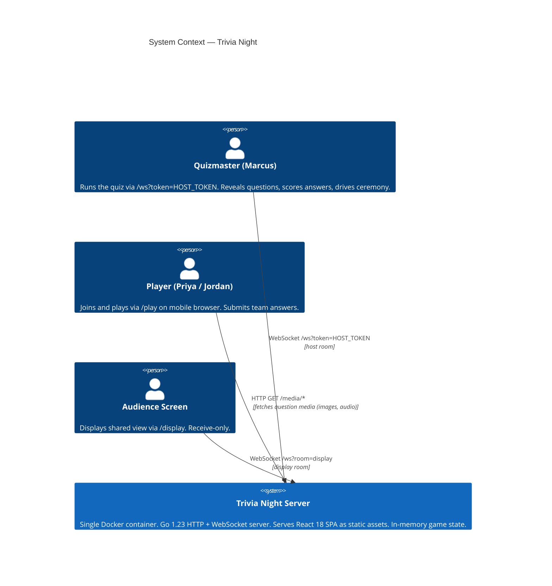
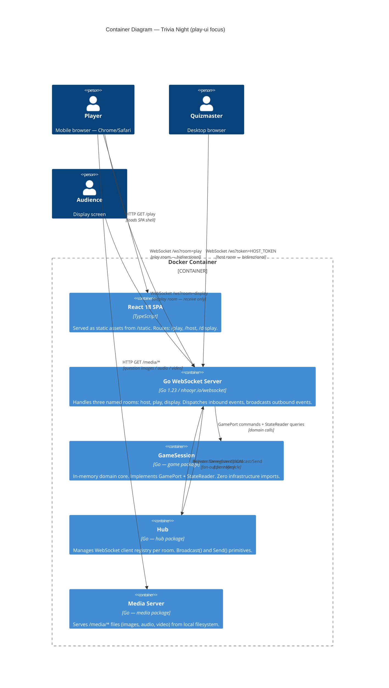
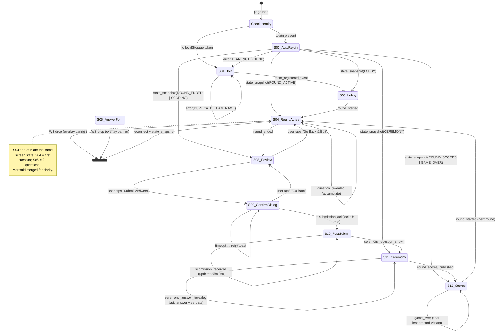

<!-- docs/product/architecture/brief.md -->
<!-- SSOT: Architecture Brief — Trivia Night -->
<!-- Updated by: nw-system-designer (play-ui DESIGN wave, 2026-04-16) -->

# Architecture Brief — Trivia Night

## System Architecture

### Back-of-Envelope Estimation

**Deployment context**: local network, 2–10 devices, single Docker container.

| Metric | Estimate | Assumption |
|--------|----------|------------|
| Peak concurrent WS connections | ~30 | 10 teams × 2 devices + 1 host + 2 display = 23; round up |
| `question_revealed` broadcast QPS | ~0.1 | 1 question every 10 s during a round |
| `draft_answer` inbound QPS | ~2 | 10 teams × 1 keystroke per 5 s, debounced |
| `submission_received` burst | 10 events/min | All teams submit within same minute |
| Payload sizes | <2 KB/event | QuestionPublic + metadata; text only |
| localStorage per device | <100 KB | 8 rounds × 10 questions × 200 bytes draft |

**Implication**: at this scale, there is no bottleneck that requires caching, queuing, or sharding. The single in-memory Go process is the correct infrastructure choice. All design decisions must serve correctness and resilience, not throughput.

---

### C4 Level 1 — System Context



---

### C4 Level 2 — Container Diagram



**Play room WebSocket flow annotation**:

1. Player connects → `PlayHandler.ServeHTTP` upgrades, registers client in `RoomPlay`, sends `state_snapshot` (no draft answers on first connect).
2. On `team_register` → `GameSession.RegisterTeam` → `team_registered` unicast → `team_joined` broadcast to host room only.
3. On `team_rejoin` → `GameSession.ValidateTeamToken` → `state_snapshot` with `DraftAnswers` for that team (unicast).
4. On `draft_answer` → `GameSession.SaveDraft` (fire-and-forget; no response).
5. On `submit_answers` → `GameSession.SubmitAnswers` → `submission_ack` unicast → `submission_received` broadcast to play room (DEP-03 resolved, see below).
6. Host events drive broadcasts from host handler: `round_started`, `question_revealed`, `ceremony_question_shown` → play + display; `ceremony_answer_revealed` → play + display (DEP-02 resolved); `round_scores_published`, `game_over` → all three rooms.

---

### WebSocket Message Table — Play Room

All messages use JSON envelope `{"event": string, "payload": {...}}`.

#### Inbound (client → server)

| Event | Payload | Screens | Status | Notes |
|-------|---------|---------|--------|-------|
| `team_register` | `{team_name: string}` | S01 | Existing | Client-side validation guards empty name |
| `team_rejoin` | `{team_id: string, device_token: string}` | S02 | Existing | |
| `draft_answer` | `{team_name: string, round_index: int, question_index: int, answer: string}` | S04–S07 | Existing | Fire-and-forget; no server response. For multi-part answers, `answer` is JSON-encoded array. |
| `submit_answers` | `{team_id: string, round_index: int, answers: [{question_index: int, answer: string}]}` | S09 | Existing | `answer` field is string for text/choice; JSON array string for multi-part |

#### Outbound (server → client)

| Event | Payload | Rooms | Trigger | Status | Notes |
|-------|---------|-------|---------|--------|-------|
| `team_registered` | `{team_id, device_token}` | unicast | `team_register` success | Existing | Client stores both to localStorage |
| `state_snapshot` | `{state, quiz, teams, current_round, revealed_questions, draft_answers?}` | unicast | connect / `team_rejoin` | Existing | `draft_answers` only populated on rejoin |
| `team_joined` | `{team_id, team_name}` | host only | `team_register` success | Existing | Not delivered to play room |
| `round_started` | `{round_index, question_count, round_name}` | all | host `host_start_round` | Existing | Triggers S04 transition |
| `question_revealed` | `{question: QuestionPublic, revealed_count, total_questions}` | play + display | host `host_reveal_question` | Existing | QuestionPublic extended per DEP-01 (see below) |
| `round_ended` | `{round_index}` | all | host `host_end_round` | Existing | Triggers S08 transition |
| `submission_ack` | `{team_id, round_index, locked: true}` | unicast | `submit_answers` success | Existing | Triggers S10 transition |
| `submission_received` | `{team_id, team_name, round_index}` | **play + host** | `submit_answers` success | **NEW (DEP-03)** | Currently host-only; extended to play room |
| `ceremony_question_shown` | `{question_index, question: QuestionPublic}` | play + display | host `host_ceremony_show_question` | Existing | Already broadcast to play room (confirmed in host.go:283) |
| `ceremony_answer_revealed` | `{question_index, answer: string, verdicts: [{team_id, team_name, verdict}]}` | **play + display** | host `host_ceremony_reveal_answer` | **CHANGED (DEP-02)** | Currently display-only; payload extended with verdicts array |
| `round_scores_published` | `{round_index, scores: [{team_id, team_name, round_score, running_total}]}` | all | host `host_publish_scores` | **CHANGED (DEP-04)** | Payload restructured from map to array with team_name |
| `game_over` | `{final_scores: [{team_id, team_name, total}]}` | all | host `host_end_game` | **CHANGED (DEP-04)** | Parallel change to include team_name |
| `error` | `{code, message}` | unicast | any validation failure | Existing | |

---

### DEP-01: QuestionPublic Schema Extension

**Problem**: `QuestionPublic` currently carries only `{text, index}`. US-11 (multiple choice) needs a `choices` array. US-12 (multi-part) needs a flag. US-13 (media) needs a `media` object. All must be absent from `QuestionFull`/`QuizFull` response paths.

**Answer confidentiality boundary**: `StripAnswers()` in `game/boundary.go` is the single conversion point from `QuestionFull` → `QuestionPublic`. Adding fields to `QuestionPublic` that derive from non-answer fields of `QuestionFull` does not breach the boundary, provided `Answer` and `Answers` (the server-canonical answer strings) are never copied into `QuestionPublic`. The new fields (`choices`, `is_multi_part`, `media`) originate from YAML presentation metadata, not answer content.

**Option A: Additive nullable fields**

Add optional fields directly to `QuestionPublic`. Absent fields serialize as `null` / omitted via `omitempty`. Consumers ignore unknown fields.

```go
type QuestionPublic struct {
    Text        string         `json:"text"`
    Index       int            `json:"index"`
    Choices     []string       `json:"choices,omitempty"`      // US-11
    IsMultiPart bool           `json:"is_multi_part,omitempty"` // US-12
    Media       *MediaRef      `json:"media,omitempty"`         // US-13
}

type MediaRef struct {
    Type string `json:"type"` // "image" | "audio" | "video"
    URL  string `json:"url"`
}
```

Trade-offs: simple, additive, backward-compatible — existing `display` and `host` consumers ignore new fields. `StripAnswers()` must be updated to copy new fields. No new types in transport layer.

**Option B: Discriminated union via `question_type` enum**

Add a `question_type: string` field (`"text"` | `"multiple_choice"` | `"multi_part"` | `"media"`) plus a `details` discriminated union payload. Frontend switches on `question_type`.

Trade-offs: explicit contract; self-documenting. But introduces a mandatory new field that breaks any hardcoded client expecting the old shape. More complex Go serialization (interface{} or generics). Overkill for 4 question types in a local game context.

**Option C: Separate event type per question variant**

Emit `question_revealed_mc`, `question_revealed_media`, etc. instead of extending the base event.

Trade-offs: no schema changes to `QuestionPublic`. But multiplies event types; `state_snapshot.revealed_questions` still must carry a unified type; complicates the frontend event dispatcher. Does not eliminate the need for a schema extension, just moves it.

**Recommendation: Option A — additive nullable fields.**

Rationale: the simplest change that satisfies all three user stories. Backward-compatible (display and host handlers receive new fields and ignore them). `StripAnswers()` remains the single conversion boundary — only the copy logic gains new lines. No new event types. The `choices` field is non-empty for multiple choice questions; `is_multi_part` is true for multi-part; `media` is present for media questions. A text question has all three absent / zero-valued.

**Confidentiality gate**: verify `QuestionFull.Answer` and `QuestionFull.Answers` are NOT copied into `QuestionPublic` by `StripAnswers()`. The `choices` field is distinct — it comes from YAML `choices:` (presenter hints), not from `answer:` / `answers:` (correct answers). `is_multi_part` is derived from `len(QuestionFull.Answers) > 1`, which is a structural flag, not an answer value. Neither leaks the answer string itself.

---

### DEP-02: ceremony_answer_revealed Broadcast Scope

**Problem**: `handleCeremonyRevealAnswer` (host.go:308) broadcasts only to `RoomDisplay`. US-08 requires players to see the revealed answer and team verdicts during ceremony. The current comment in host.go says "Answer revealed only to display room (not play room — boundary rule)."

**Clarification**: that comment was written before play-ui existed. The boundary rule prohibits `QuestionFull.Answer` from appearing in transport. A revealed ceremony answer is a different object: it is an already-scored result published deliberately by the quizmaster. There is no confidentiality violation in sending it to the play room once the host has explicitly revealed it during CEREMONY state.

**Server-side game state gate**: `handleCeremonyRevealAnswer` calls `session.CeremonyAnswer(roundIndex, questionIndex)` which is only callable after `session.StartCeremony()` or `session.AdvanceCeremony()` have succeeded. These transitions require the game state to be `StateCeremony` (validated by `ValidateTransition` in state.go). If the game is not in `CEREMONY` state, the host command fails before reaching the broadcast call. Players cannot receive this event outside CEREMONY state.

**Option A: Extend existing event to play + display (+ add verdicts)**

Broadcast `ceremony_answer_revealed` to both `RoomDisplay` and `RoomPlay`. Extend the payload with a `verdicts` array so players can see which teams got it right.

```go
type CeremonyAnswerRevealedPayload struct {
    QuestionIndex int             `json:"question_index"`
    Answer        string          `json:"answer"`
    Verdicts      []TeamVerdict   `json:"verdicts,omitempty"` // new
}

type TeamVerdict struct {
    TeamID   string `json:"team_id"`
    TeamName string `json:"team_name"`
    Verdict  string `json:"verdict"` // "correct" | "incorrect"
}
```

Trade-offs: single event, single broadcast call. Display room receives `verdicts` array it was not getting before — it may render it (which is fine: display showing verdicts per team is valid). Payload size increase is small (~10 teams × 50 bytes = 500 bytes).

**Option B: Separate `ceremony_answer_revealed_play` event**

Keep the existing event for display-only. Add a new event for the play room with a subset payload (no raw answer, just verdicts and question index).

Trade-offs: preserves exact current display behavior. But introduces a new event type that software-crafter must handle. The rationale for hiding the raw answer from players is weak: the answer is being read aloud in the room. Adds complexity for no security gain.

**Option C: Players poll state_snapshot**

Do not change broadcast rules. Players poll (or request) a state update after `ceremony_question_shown` arrives to get the answer.

Trade-offs: breaks the event-driven model. Requires polling or a new request/response pattern. Latency between reveal and player display. Not aligned with architecture principle that all transitions are driven by WebSocket events.

**Recommendation: Option A — extend existing event to play + display, add verdicts array.**

Rationale: minimal change, correct semantics, state-gated by CEREMONY game state. The verdicts array is valuable to players (US-08 requires "got it / missed it" per team). Display room receiving verdicts is an enhancement, not a problem. Change is confined to one line in `handleCeremonyRevealAnswer` (add `RoomPlay` broadcast) and the payload struct extension.

**State gate confirmation**: the event is only emitted inside `handleCeremonyRevealAnswer`, which is reachable only after `host_ceremony_show_question` has been processed at least once (which calls `session.StartCeremony()` on `questionIndex == 0`, transitioning to `StateCeremony`). Players cannot receive this event in any other game state.

---

### DEP-03: submission_received Broadcast to Play Room

**Problem**: `handleSubmitAnswers` in play.go:228 broadcasts `submission_received` to `RoomHost` only. US-07 requires all play-room clients to see real-time submission status of other teams.

**Option A: Add play room to the existing broadcast**

Change `ph.h.Broadcast(hub.RoomHost, ...)` to also call `ph.h.Broadcast(hub.RoomPlay, ...)`. The existing `SubmissionReceivedPayload` already carries `team_id`, `team_name`, and `round_index` — sufficient for US-07.

Trade-offs: 2-line change. No new event type. The play room receives its own `submission_received` event when it submits (redundant but harmless — client already transitions to S10 on `submission_ack`; the `submission_received` for self just confirms the status). Client ignores duplicate or uses it to mark self as submitted on the list.

**Option B: New `submission_status_update` event for play room only**

Emit a different event to the play room with a status-oriented payload. Separates host-facing semantic (submission arrived, trigger scoring workflow) from player-facing semantic (update the waiting list).

Trade-offs: cleaner semantic separation. Extra event type and handler. The host `submission_received` event is already well-named for the player use case (a submission was received). No meaningful benefit in this codebase.

**Option C: Include submission counts in state_snapshot only (no live events)**

Players receive counts at reconnect via state_snapshot. No live `submission_received` broadcast.

Trade-offs: breaks the real-time requirement of US-07. Not viable.

**Recommendation: Option A — broadcast to play room alongside host room.**

Rationale: `SubmissionReceivedPayload` already contains `team_name` (confirmed in events.go), which is what the player UI needs. Change is additive (one broadcast call). No schema change. The play client receiving its own submission event is idempotent if the client tracks already-submitted state (which it does via S10 transition from `submission_ack`).

---

### DEP-04: round_scores_published Team Name Resolution

**Problem**: `RoundScoresPayload.Scores` is `map[string]int` keyed by `team_id`. `GameOverPayload.FinalScores` is `map[string]int` keyed by `team_id`. Players do not hold a `team_id → team_name` lookup in a reliable structure (localStorage holds their own team's name, and the teams list from `state_snapshot` could be stale after disconnects).

**Option A: Include team_name alongside team_id in the payload (restructure to array)**

Change the payload from `map[string]int` to a typed array:

```go
type ScoreEntry struct {
    TeamID       string `json:"team_id"`
    TeamName     string `json:"team_name"`
    RoundScore   int    `json:"round_score"`
    RunningTotal int    `json:"running_total"`
}

type RoundScoresPayload struct {
    RoundIndex int          `json:"round_index"`
    Scores     []ScoreEntry `json:"scores"`
}
```

Trade-offs: single source of truth. No client-side resolution logic. Breaking change to the existing payload shape (currently `scores: {team_id: int}`). Host UI and display consumers must be updated to handle the new structure. Currently the host already receives `score_updated` events during scoring — the host may not even use `round_scores_published` for display. **Investigate before implementing.**

**Option B: Client resolves via teams list from state_snapshot**

The play client holds `state_snapshot.teams` at join / rejoin time. On `round_scores_published`, the client looks up `team_id → team_name` from its local teams list.

Trade-offs: no backend change. Risk: teams list in client state may be incomplete if a player joined mid-game after teams registered (state_snapshot should include all registered teams at that point — confirmed from play.go:43 which includes `Teams: ph.reader.TeamRegistry()`). The client's team registry is accurate as of last connect/rejoin. For a 2–10 device local game with no team joins after round start, the risk is negligible.

**Option C: New `scores_with_names` event emitted alongside existing `round_scores_published`**

Emit the existing event unchanged (for backward compatibility with host/display) and add a new enriched event for play room.

Trade-offs: no breaking change to existing consumers. Adds a new event name. Adds a new broadcast call in `handlePublishScores`. Increases complexity for a problem that Option B solves with zero backend changes.

**Recommendation: Option A for correctness, with Option B as the simpler migration path.**

The journey YAML (play.yaml line 697) already shows the desired payload as `scores: [{team_name, round_score, running_total}]` — Option A matches the already-designed contract. The host UI currently receives `round_scores_published` and must be checked; if it only uses `score_updated` events for host display (likely), Option A is a non-breaking change to host behavior. Option A is the correct long-term design. Option B is acceptable for the Walking Skeleton release if bandwidth is a concern.

**Design decision for this wave: Option A.** The payload restructuring must be done before the scores screen (US-09) is implemented. Both `round_scores_published` and `game_over` payloads restructure to typed arrays with `team_name` included. `GameOverPayload.FinalScores` becomes `[]FinalScoreEntry{TeamID, TeamName, Total}`.

---

### Reconnection / Rejoin State Machine

**States**: `DISCONNECTED → CONNECTING → CONNECTED → REGISTERED` (for new players) or `CONNECTED → REJOIN_PENDING → REJOINED` (for returning players).

```
Browser opens /play
        |
        v
   [Check localStorage]
        |
   +----+----+
   |         |
no token   token present
   |         |
   v         v
[S01 Join] [S02 Auto-Rejoin]
   |         |
   |    send team_rejoin
   |         |
   |    await state_snapshot
   |         |
   +----+----+
        |
   state_snapshot received
        |
   [route by game_state]
   LOBBY          → S03
   ROUND_ACTIVE   → S04/S05 (restore drafts from localStorage)
   ROUND_ENDED    → S08
   SCORING        → S08 (locked, read-only)
   CEREMONY       → S11
   ROUND_SCORES   → S12
   GAME_OVER      → S12 (final variant)
```

**WsClient reconnect → rejoin sequencing**:

1. WsClient fires exponential-backoff reconnect (already implemented in `frontend/src/ws/client.ts`).
2. On new WebSocket connection established, WsClient emits `connected` event internally.
3. `useWebSocket` hook listens for `connected` event. On reconnect (not first connect), it checks localStorage for `team_id` + `device_token`.
4. If both present: send `team_rejoin` immediately (within the same connection, before any other messages).
5. Server responds with `state_snapshot` including `draft_answers` for that team.
6. Client: merge `state_snapshot.draft_answers` with `localStorage.trivia_draft_answers`. **localStorage wins on conflict** (DISCUSS D6). Server drafts are advisory.
7. Screen routing executes based on `state_snapshot.state`.
8. Connection status banner clears.

**Draft restoration on reconnect** (order of operations):

```
1. Read localStorage.trivia_draft_answers[current_round]
2. Receive state_snapshot.draft_answers (server-side saved drafts)
3. For each question: localStorage value wins if non-empty; server value fills gaps
4. Populate answer form fields before first paint
5. User sees their answers intact
```

**TEAM_NOT_FOUND on rejoin**:

```
1. Server sends error{code: "invalid_token"}
2. Client: show "We couldn't find your team — please join again"
3. Do NOT clear localStorage immediately (preserve drafts in case server restarted temporarily)
4. Show join form. On new team_register success: overwrite localStorage with new identity
```

---

### localStorage ↔ Server State Sync Pattern

**Canonical ownership**:

| Data | Canonical Store | Server Role |
|------|----------------|-------------|
| `trivia_team_id` | localStorage | Source (issued by server on `team_registered`) |
| `trivia_device_token` | localStorage | Source (issued by server on `team_registered`) |
| `trivia_team_name` | localStorage | Echo (held by server in TeamRegistry) |
| `trivia_draft_answers` | **localStorage** | Cache (server holds `drafts` map; secondary) |
| `revealed_questions` | React state (in-memory) | Source (rebuilt from `state_snapshot` on reconnect) |
| `game_state` | React state (in-memory) | Source (always from server; never persisted client-side) |
| `submission_status` (own team) | React state (in-memory) | Source (from `submission_ack`) |
| `submission_status` (other teams) | React state (in-memory) | Source (from `submission_received` events) |

**Conflict resolution rules**:

1. `trivia_draft_answers`: localStorage wins over server on reconnect. Rationale: localStorage is written on every keystroke (debounced 300ms). The server draft is written on blur only. If both exist for the same question, localStorage is more recent.
2. `game_state`: server always wins. Client never writes game state to localStorage (it is volatile by design — a reconnect must consult the server).
3. `revealed_questions`: rebuilt from `state_snapshot.revealed_questions` on every connect/reconnect. Client accumulates additional `question_revealed` events on top. On reconnect, the snapshot is the authoritative baseline.
4. `team_id` / `device_token`: written once on `team_registered`; never overwritten until player explicitly clears identity (escape hatch "That's not us"). On `TEAM_NOT_FOUND`, prompt the player — do not auto-clear.

**localStorage key schema** (established in DISCUSS D6):

```
trivia_team_id          → string (UUID)
trivia_device_token     → string (UUID)
trivia_team_name        → string
trivia_draft_answers    → JSON: {[round_index: string]: {[question_index: string]: string | string[]}}
```

Note: `string[]` for multi-part answers (US-12). The `draft_answer` WS message sends the array JSON-encoded as the `answer` string field (preserving the existing `DraftAnswerMsg` shape). Backend `SaveDraft` stores the raw string; the client re-parses it on restoration if the question is multi-part.

**Draft clearing rule**: on `round_started` event, the client clears the *displayed* draft for the previous round but does **not** delete the localStorage entry. Previous round's drafts remain in localStorage for the session (debugging; late submission edge cases). Display is driven by `current_round` from state, so old drafts are naturally invisible.

---

### Play Room State Machine



**Screen-to-state mapping**:

| Screen | Trigger event(s) | Leaves on |
|--------|-----------------|-----------|
| S01 Join | Page load, no token | `team_registered` |
| S02 Auto-Rejoin | Page load, token present | `state_snapshot` or `error(TEAM_NOT_FOUND)` |
| S03 Lobby | `team_registered` or `state_snapshot(LOBBY)` | `round_started` |
| S04/S05 Answer Form | `round_started` or `state_snapshot(ROUND_ACTIVE)` | `round_ended` |
| S08 Review | `round_ended` | `submission_ack` |
| S09 Confirm Dialog | User tap | `submission_ack` or user cancel |
| S10 Post-Submit | `submission_ack(locked: true)` | `ceremony_question_shown` |
| S11 Ceremony | `ceremony_question_shown` | `round_scores_published` |
| S12 Scores | `round_scores_published` | `round_started` or `game_over` |
| S_Connection | WS disconnect | WS reconnect |

---

### Backend Wiring Changes

Changes required to support play-ui, listed per file. All changes are additive or minimal modifications. No new packages are introduced.

#### `internal/game/public_types.go`

**Change**: additive fields to `QuestionPublic` struct.

Add `Choices []string`, `IsMultiPart bool`, `Media *MediaRef` fields with `omitempty` JSON tags. Add new `MediaRef` struct (`Type string`, `URL string`).

Nature: additive field extension. No existing code breaks. Host and display consumers receive new fields and ignore them (Go JSON decoder ignores unknown fields; existing TypeScript consumers ignore unknown fields).

#### `internal/game/boundary.go`

**Change**: update `StripAnswers()` to copy new structural fields.

The function must copy `Choices`, `IsMultiPart` (derived from `len(q.Answers) > 1`), and `Media` from `QuestionFull` to `QuestionPublic`. **Answer fields (`Answer`, `Answers`) must remain excluded.** Add a comment explicitly listing each excluded field.

Nature: pure logic extension within the single sanctioned conversion point (DEC-010). No transport layer changes required.

#### `internal/quiz/schema.go`

**Change**: extend `yamlQuestion` to include typed `Choices` and `Media` fields (currently parsed as `interface{}`).

Replace `Choices []interface{}` with `Choices []string`. Replace `Media interface{}` with `Media *yamlMedia`. Add `yamlMedia struct { Type string \`yaml:"type"\`; URL string \`yaml:"url"\` }`.

Nature: schema tightening of already-parsed fields. The quiz loader must propagate these into `QuestionFull` so `StripAnswers()` can copy them.

#### `internal/game/types.go`

**Change**: extend `QuestionFull` to carry structural (non-answer) metadata needed by `StripAnswers()`.

Add `Choices []string` and `Media *MediaRef` fields to `QuestionFull`. These are not answer fields. `IsMultiPart` does not need a stored field — it is derived at conversion time from `len(q.Answers) > 1`.

Nature: additive struct extension. No answer fields affected.

#### `internal/hub/events.go`

**Change 1 (DEP-02)**: extend `CeremonyAnswerRevealedPayload` with a `Verdicts []TeamVerdict` field. Add `TeamVerdict` struct (`TeamID`, `TeamName`, `Verdict` strings).

**Change 2 (DEP-03)**: no struct change required — `SubmissionReceivedPayload` already carries `team_id`, `team_name`, `round_index`.

**Change 3 (DEP-04)**: replace `RoundScoresPayload.Scores map[string]int` with `Scores []ScoreEntry`. Add `ScoreEntry` struct (`TeamID`, `TeamName`, `RoundScore`, `RunningTotal` fields). Rename the constructor `NewRoundScoresPublishedEvent` signature to accept `[]ScoreEntry`. Similarly extend `GameOverPayload.FinalScores` from `map[string]int` to `[]FinalScoreEntry`.

Nature: struct changes. Breaking change to `RoundScoresPayload` and `GameOverPayload` shapes. Must coordinate with host-ui and display consumers.

#### `internal/handler/host.go`

**Change 1 (DEP-02)**: in `handleCeremonyRevealAnswer`, add `hh.hub.Broadcast(hub.RoomPlay, evt)` after the existing `RoomDisplay` broadcast. Extend event construction to include verdicts: requires calling `session.VerdictsByQuestion(roundIndex, questionIndex)` or equivalent. This may require a new method on `StateReader` or `GameSession`.

**Change 2 (DEP-04)**: in `handlePublishScores`, replace `scores := session.RoundScores(payload.RoundIndex)` (returns `map[string]int`) with a richer call that returns `[]ScoreEntry` including team names. This requires either a new method on `GameSession` (e.g., `RoundScoresWithNames(roundIndex int) []hub.ScoreEntry`) or resolution within the handler using `TeamRegistry()`. Similarly update `handleEndGame`.

Nature: broadcasting rule changes and payload construction changes. Both are confined to this file.

#### `internal/handler/play.go`

**Change (DEP-03)**: in `handleSubmitAnswers`, after the existing `Broadcast(hub.RoomHost, ...)` call, add:

```go
_ = ph.h.Broadcast(hub.RoomPlay, hub.NewSubmissionReceivedEvent(payload.TeamID, teamName, payload.RoundIndex))
```

Nature: one additional broadcast call. `teamName` is already resolved above the existing host broadcast line.

#### `internal/game/game.go` (or new method file)

**Change (DEP-02 support)**: add a `VerdictsByQuestion(roundIndex, questionIndex int) []TeamVerdictResult` method (or equivalent) that returns per-team verdicts for a given question, for use when constructing the `ceremony_answer_revealed` event payload. The `GameSession` already holds `submissions` with `Verdict` fields.

**Change (DEP-04 support)**: add a `RoundScoresWithNames(roundIndex int) []ScoreEntry` method (or equivalent) that joins round scores with team names from the registry. The `GameSession` has both `roundScoresMap` and `teams` map.

Nature: new read methods on `GameSession`. No state mutation.

#### `internal/game/boundary_test.go`

**Change**: add test cases verifying that `StripAnswers()` on a `QuestionFull` with `Answer`, `Answers`, `Choices`, and `Media` fields:
1. Does NOT include `Answer` or `Answers` in the result.
2. DOES include `Choices` and `Media` in the result.
3. Sets `IsMultiPart = true` when `len(Answers) > 1`.

Nature: test extension. Enforces the confidentiality boundary for new fields.

---

### No New Packages

All changes are confined to existing packages. The `media` package (`internal/media/server.go`) already serves `/media/*` files — no changes required for US-13 (the frontend fetches media URLs directly from the `media` field in `QuestionPublic`).

---

### Open Risk Register

| Risk | Likelihood | Impact | Mitigation |
|------|-----------|--------|-----------|
| `QuestionPublic` extension exposes answer via `IsMultiPart` | Low | Critical | `IsMultiPart` is a count-derived boolean, not an answer value. Add explicit test in `boundary_test.go`. |
| `ceremony_answer_revealed` sent outside CEREMONY state | Very Low | High | Go game state machine enforces transition via `ValidateTransition`. Existing tests cover illegal transitions. |
| `round_scores_published` payload restructure breaks host UI | Medium | Medium | Audit host-ui TypeScript consumers before shipping DEP-04. The host may rely only on `score_updated` events for live display. |
| Safari WS reconnect behaves differently from Chrome | Medium | Medium | WsClient already implements reconnect. Test explicitly on iPhone Safari as part of Walking Skeleton acceptance. |
| Multi-part draft stored as JSON string in `draft_answer` message | Low | Low | Document the encoding explicitly. Backend `SaveDraft` stores the raw string; client is responsible for parse. Alternative: add `answers: []string` field to `DraftAnswerMsg` in Release 2. |

---

*Section written by: nw-system-designer (Titan) — play-ui DESIGN wave — 2026-04-16*
